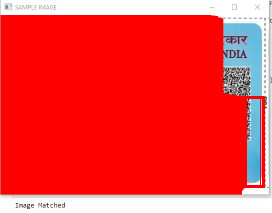
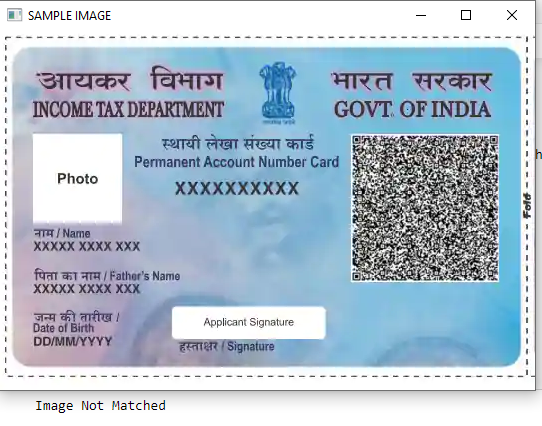

# PAN_CARD_TEMPLATE_MATCHING_OPENCV

We Can Use This When We Want A Pan Card Image From User. Through This We Can Easily Verify Whether User Upload A Proper Image Or Something Else.
This Models Matches The Template Of PAN CARD With A Sample Image Saved In This Model. 

This Repository Contain (PAN_CARD_TEMPLATE_MATCHING.ipynb) File Through Which You Can Run Code. 😄

If Image (Given By User) is Verified:

If Image (Given By User) is not Verified:

